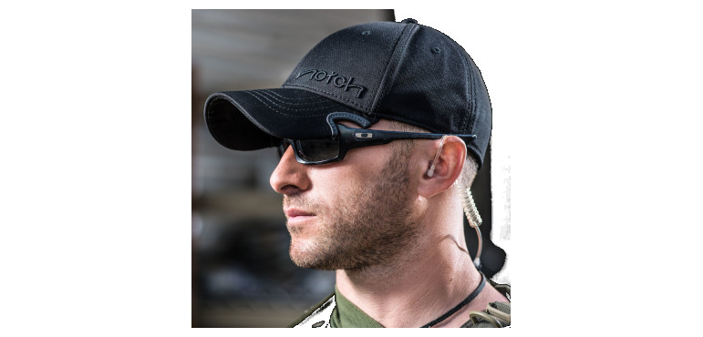

# Couvre-chef
En complément des lunettes, porter un chapeau ou une casquette permet simplement mais efficacement de limiter l'éblouissement par des sources hautes (ciel clair, soleil,  néons des magasins, etc.). Si je porte depuis des années, et au grand désarroi de mon épouse, une casquette tout à fait banale, il existe des [casquettes spécialement conçues](https://notchgear.com/) pour le port de lunettes "envahissantes":

