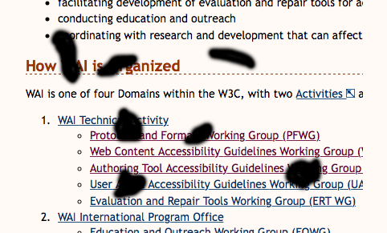

# Déficiences visuelles

Ce document est un extrait, traduit en français, [d'un texte rédigé en anglais](https://w3c.github.io/low-vision-a11y-tf/requirements.html#visual-impairments) par le [W3C](https://fr.wikipedia.org/wiki/World_Wide_Web_Consortium).

La section qui suit introduit brièvement cinq types de déficiences visuelles:

1. Acuité visuelle (clarté)
1. Sensibilité à la lumière et à l'éblouissement
1. Sensibilité au contraste
1. Champ de vision
1. Perception des couleurs

## Acuité visuelle ( Clarté)

L'acuité visuelle est la clarté ou la netteté de la vision. Elle se rapporte aux plus petits détails qu'une personne peut percevoir. Elle dépend généralement du fonctionnement de la partie de la rétine de l'œil et de l'interprétation du cerveau. La mesure de l'acuité visuelle de la distance est basée sur une norme de 20/20 (6/6 en métrique).

Une faible acuité visuelle peut être corrigée avec des lunettes, des lentilles de contact ou une chirurgie – et d’autres ne le peuvent pas. Par conséquent, certaines personnes ne verront pas du tout de petits textes ni de détails fins.

## Sensibilité à la lumière et à l'éblouissement

De nombreuses personnes malvoyantes ont une sensibilité extrême à la lumière (appelée photophobie). La lumière vive rend difficile ou impossible la vision, et provoque des douleurs oculaires et des maux de tête. Pour certaines personnes, la luminosité normale d'un écran d'ordinateur avec un fond lumineux n'est pas lisible et douloureuse. Ces personnes doivent alors changer le fond en une couleur plus foncée. La sensibilité à l'éblouissement accompagne fréquemment les modifications de la vision liées à l'âge et aux cataractes.

## Sensibilité au contraste

La sensibilité au contraste est la capacité de détecter les différences de luminosité, par exemple, à discerner le texte de son contexte. Une barrière d'accessibilité commune pour les personnes à faible sensibilité au contraste est le texte gris sur fond clair.

Le contraste est basé sur la luminosité. Les couleurs qui semblent très différentes (par exemple, rouge, bleu, vert) peuvent avoir une brillance similaire, et ne pas fournir un contraste suffisant. Des outils sont disponibles pour déterminer le rapport de contraste entre les couleurs.

## Champ de vision

Le champ de vision, ou champ visuel, est la zone entière qui peut être vue lorsque l'œil est dirigé vers l'avant, y compris ce qui est vu avec la vision périphérique. Certaines affections oculaires et neurologiques provoquent une perte de champ de champ, où les gens ont un champ de vision plus petit ou obscurci. Par exemple, une perte importante de champ périphérique, parfois appelée « vision du tunnel », est un peu comme regarder à travers une paille de boisson.

Les types de perte de champ visuel peuvent être regroupés comme suit:

* Perte du champ périphérique: Les gens ne voient que dans la partie centrale de leur champ visuel.
* Perte centrale du champ : La vision est réduite ou absente au milieu de la vision des gens.
* Autres pertes de champ: Les gens ont des taches éparpillées de vision obscure, ont un anneau de perte de champ, ont une perte de champ dans la partie gauche ou droite de leur vision, ou d'autres pertes de champ.

### Exemples simulés de perte de champ visuel:

#### Perte du champ visuel central

#### Perte du champ visuel periphérique

#### Autre type de perte du champ visuel

# Retour
[Cliquez ici pour retourner à l’index.](index)
