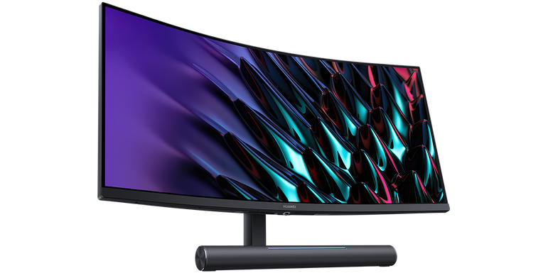
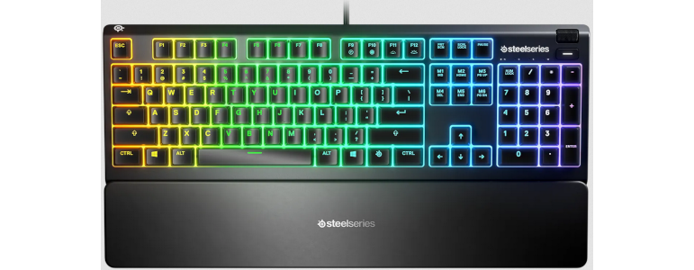

# Matériel informatique

## Écran
Pour remplacer deux écrans "plats" de 14" vieillissants et au contraste et à la profondeur de noir médiocres, je cherchais un écran unique, incurvé, de 34" ou plus, avec de bons contrastes et une bonne profondeur de noir.

Après lecture de quelques comparatifs en ligne, j'hésitais entre le [Huawei Mateview GT 34"](https://consumer.huawei.com/fr/monitors/mateview-gt) et les gammes [Samsung](https://www.samsung.com/fr/monitors/curved/). La décision finale s'est jouée sur la possibilité d'acquérir le Huawei en solde, ainsi que sur quelques éléments de second ordre, tels que l'empiètement du support sur le bureau.

## Clavier
Travaillant désormais dans un environnement relativement sombre, j'ai fait le choix de changer le bon vieux [clavier Dell rustique](https://www.amazon.fr/dp/B01E7V73IE) auquel j'étais habitué pour un clavier retro-éclairé. Les critères considérés étaient les suivants:
* disposition QWERTY US avec pavé numérique,
* type [membrane](https://www.darty.com/darty-et-vous/high-tech/informatique/pc-mac/clavier-membrane-et-mecanique-quelles-differences) pour limiter le bruit,
* éclairage "à travers" les touches et pas uniquement "autour" des touches,
* allure sobre

Parmi les marques que j'ai utilisées au fil des années, Logitech et Steelseries proposaient les meilleures options. Mon choix s'est finalement porté sur le [Steelseries Apex 3](https://steelseries.com/gaming-keyboards/apex-3) dont le seul défaut est un éclairage "autour des touches" trop intense à mon goût comparativement à l'éclairage "à travers" les touches. Je n'ai pas trouvé de claviers éclairage uniquement "à travers", sans éclairage "autour".

Note: il existe également des claviers avec des touches spécialement conçues pour offrir un contraste élevé:

## Retour
[Cliquez ici pour retourner à l’index.](index)
