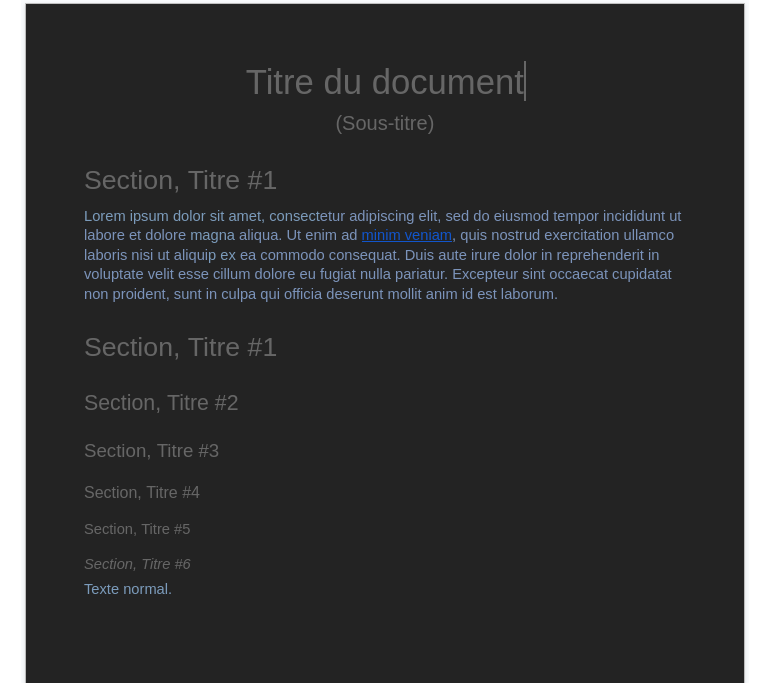
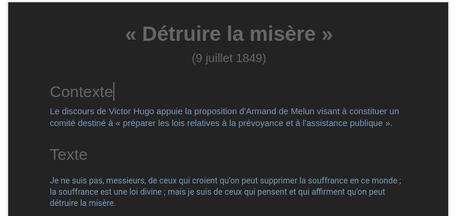
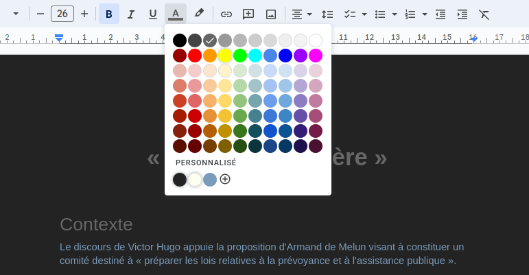

z# Google Doc

## Modèle de document en mode sombre
Pour soulager ma lecture sur écran, j'ai créé le modèle ci-dessous. Vous pouvez le copier librement depuis [cette page](https://docs.google.com/document/d/1p7zmmEuRnwjPx2q9UjMgHolxJdEXOa-jvPR0P1smqZA/edit?usp=sharing).

### Modèle

### Exemple

### Références des couleurs
Les couleurs utilisées sont les suivantes:
* Fond: `#232323`
  * Configurable depuis `Fichier > Configuration de la page > Couleur de la page`.
  * Si vous souhaitez que cette couleur soit utilisée par défaut, cliquez sur "Définir comme valeurs par défaut".
* Titres: `#666666`
  * Ce n'est autre que le `Gris 3`, de la palette.

* Texte normal: `#7b9bbb`
  * Configurable depuis la palette.
  * La couleur `#7b9bbb` est une version moins saturée du `Cyan Clair 1` de la palette.

Si vous souhaitez que les couleurs de titre et de texte normal soient utilisées par défaut, ouvrez le menu `Format > Style de paragraphe > Options > Enregistrer en tant que mes styles par défaut`.

# Retour
[Cliquez ici pour retourner à l’index.](index)
