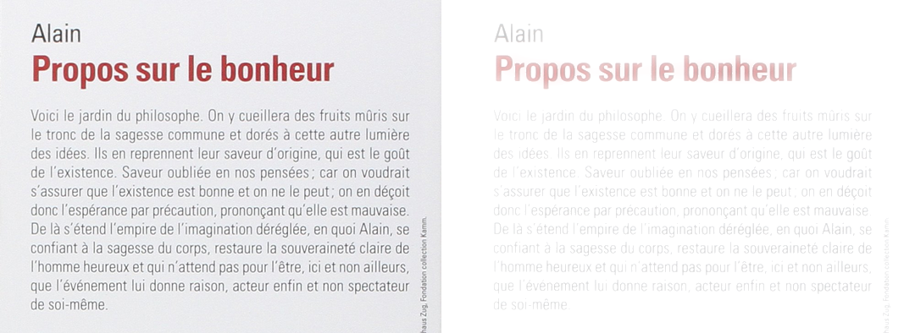
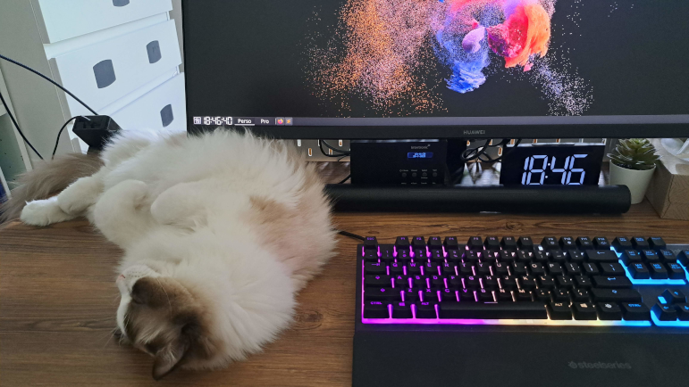
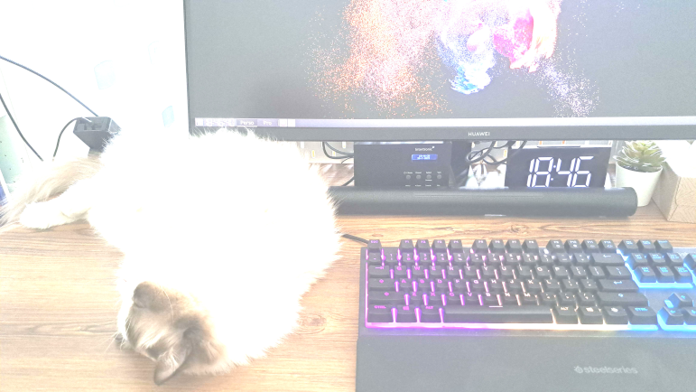
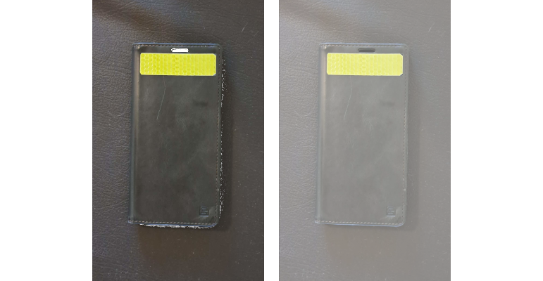

# Gérer l'hypersensibilité à la lumière

J'ai récemment développé une [hypersensibilité à la lumière](deficiences-visuelles.md#sensibilit%C3%A9-%C3%A0-la-lumi%C3%A8re-et-%C3%A0-l%C3%A9blouissement). Je partage ici quelques mesures et équipements qui m'aident à vivre cette situation aussi normalement que possible. Si vous ou l'un de vos proches vivez la même situation, j'espère que ces quelques lignes vous seront utiles.

## Contexte
En mai 2023, j'ai fait une [réaction auto-immune](https://fr.wikipedia.org/wiki/Enc%C3%A9phalomy%C3%A9lite_aigu%C3%AB_diss%C3%A9min%C3%A9e) qui m'a temporairement rendu totalement aveugle. J'ai heureusement été remarquablement pris en charge par les équipes du [CHUV](https://fr.wikipedia.org/wiki/Centre_hospitalier_universitaire_vaudois) à Lausanne et moins de deux mois après la fin du traitement, j'avais récupéré la majorité des [capacités sensorielles](deficiences-visuelles) qui constituent la vision:
* l'**acuité visuelle** (le célèbre "10/10 à chaque oeil"),
* le **champ visuel**,
* la **perception des couleurs**, en commençant par le jaune et le bleu et laissant donc le rouge revenir en dernier, ce qui n'est pas sans ironie pour un résident suisse.

Aujourd'hui, seules ma **sensibilité à la lumière** et ma **sensibilité aux contrastes faibles** sont toujours déficientes. Concrètement, je suis beaucoup plus facilement ébloui qu'auparavant par les objets blancs, clairs et les couleurs saturées (les néons des magasins, par exemple). En raison de la mauvaise gestion de la luminosité, il m'est également plus difficile de repérer les objets ton sur ton, comme par exemple mon téléphone noir posé sur une surface noire.

## Exemples
### Éblouissement
Les montages ci-dessous illustrent (maladroitement) l'éblouissement ressenti dans certaines situations.

À la lecture d'un texte imprimé en noir sur fond blanc:
* à gauche: page perçue avec une vision "normale"
* à droite: la même page perçue avec une hypersensibilité à la lumière et en l'absence de lunettes

En milieu normalement éclairé:
* en haut: scène perçue avec une vision "normale"
* en bas: la même scène perçue avec une hypersensibilité à la lumière et en l'absence de lunettes

### Contrastes faibles
Pour me faciliter la vie, j'ai aposé des bandes fluo autocollantes sur la plupart des objets que j'ai du mal à repérer.

Heureusement, grâce aux équipes du CHUV et de [l'hôpital ophtalmique Jules Gonin](https://www.ophtalmique.ch/), j'ai pu adapter mon environnement de façon à mener une vie aussi normale que possible. Cette section du site a pour but de partager ces adaptations. J'espère qu'elle sera utile à d'autres personnes hypersensibles à la lumière mais qui n'ont pas eu la chance d'être accompagnés et conseillés comme je l'ai été.

## Remarque sur les liens
Lorsque cela est possible, j'inclus un lien vers les produits ou logiciels que je mentionne. Je n'en retire aucun bénéfice d'aucune sorte. Je le fais uniquement pour identifier sans équivoque ce dont je parle, au cas où un lecteur de cette page souhaiterait en savoir plus.

Enfin, sauf mention contraire, j'utilise moi-même les références mentionnées.

## Lunettes et accessoires
* [Lunettes de soleil](lunettes-de-soleil)
* [Lunettes de vue](lunettes-de-vue)
* [Couvre-chef](couvre-chef)
* [Montre](montre)

## Prise de notes
* [Options de prise de notes](prise-de-notes)

## Informatique
* [Matériel](materiel-informatique)
* [Logiciels](logiciels)

## Téléphone
* [Modèle](natel)
* Réglages
* Applications
