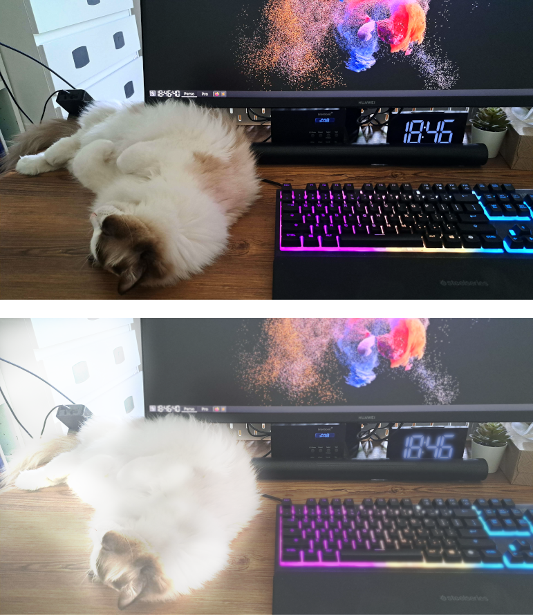

# Gérer l'hypersensibilité à la lumière

## Objet
J'au récemment développé une hypersensibilité à la lumière. Je partage ici quelques mesures et équipements qui m'aident à vivre cette situation aussi normalement que possible. Si vous ou l'un de vos proches vivez la même situation, j'espère que ces quelques paragraphes se montreront utiles.

## Contexte
En mai 2023, j'ai fait une [réaction auto-immune](https://fr.wikipedia.org/wiki/Enc%C3%A9phalomy%C3%A9lite_aigu%C3%AB_diss%C3%A9min%C3%A9e) qui m'a temporairement mais totalement fait perdre la vue. J'ai heureusement été remarquablement pris en charge par les équipes du [CHUV](https://fr.wikipedia.org/wiki/Centre_hospitalier_universitaire_vaudois) à Lausanne.

Moins de deux mois après la fin du traitement, j'avais récupéré la majorité des [capacités sensorielles](https://w3c.github.io/low-vision-a11y-tf/requirements.html#visual-impairments) qui constituent la vision:
* l'**acuité visuelle** (le célèbre "10/10 à chaque oeil"),
* le **champ visuel**,
* la **perception des couleurs**, en commençant par le jaune et le bleu et laissant donc le rouge revenir en dernier, ce qui n'est pas sans ironie pour un résident suisse.

Aujourd'hui, seules ma **sensibilité à la lumière** et ma **sensibilité aux contrastes faibles** sont toujours déficientes. Concrètement, je suis beaucoup plus facilement ébloui qu'auparavant par les objets blancs, clairs et les couleurs saturées (les néons des magasins, par exemple). 

Les montages ci-dessous illustrent (maladroitement) l'éblouissement ressenti dans certains contextes.

À la lecture d'un texte imprimé en noir sur fond blanc:
* à gauche: page perçue avec une vision "normale"
* à droite: la même page perçue avec une hypersensibilité à la lumière et en l'absence de lunettes

En milieu normalement éclairé:
* en haut: scène perçue avec une vision "normale"
* en bas: la même scène perçue avec une hypersensibilité à la lumière et en l'absence de lunettes

Lié à l'hypersensibilité à la lumière, je peux avoir des difficultés à repérer les objets ton sur ton, comme mon téléphone noir posé sur une surface noire, par exemple.

Heureusement, grâce aux équipes du CHUV et de [l'hôpital ophtalmique Jules Gonin](https://www.ophtalmique.ch/), j'ai pu adapter mon environnement de façon à mener une vie aussi normale que possible. Cette section du site a pour but de partager ces adaptations. J'espère qu'elle sera utile à d'autres personnes hypersensibles à la lumière mais qui n'ont pas eu la chance d'être accompagnés et conseillés comme je l'ai été.

## Remarque sur les liens "commerciaux¨
Lorsque cela est possible, j'inclus un lien vers les produits ou logiciels que je mentionne. Je n'en retire aucun bénéfice d'aucune sorte. Je le fais uniquement pour identifier sans équivoque les objets dont je parle, au cas où un lecteur de cette page serait aujourd´hui dans la situation qui était la mienne à la sortie de l'hôpital.

Enfin, sauf mention contraire, j'utilise moi-même les références que je présente.

## Vêtements et accessoires
### Lunettes de soleil
Étant hypersensible à la lumière, porter des lunettes de soleil appropriées a considérablement amélioré ma qualité de vie. D'après mes discussions avec des ergothérapeutes et des opticiens spécialisés, le choix des lunettes capables de soulager l'hypersensibilité repose sur les éléments suivants:
1. la teinte des verres, plus ou moins foncée
2. la polarisation des verres
3. la géométrie de la monture: courbure et épaisseur des branches

#### Teinte des verres
##### Éblouissement et UV
Il faut distinguer protection contre l'éblouissement et protection contre les ultra-violets. Par définition, **l'éblouissement est causé par la lumière visible**. S'en protéger passe par le port de verres teintés. Au contraire, **les ultra-violets sont invisibles**, puisqu'ils correspondent là aussi par définition au spectre lumineux au delà du violet, qui est la couleur la plus intense perceptible par l'oeil humain. S'en protéger passe par l'application d'un traitement sur les verres. Ce traitement peut être invisible.

En résumé, des verres très sombres, c'est-à-dire très efficaces contre l'éblouissement, ne protègeront pas nécessairement contre les UV. Inversement, des verres transparents traités contre les UV peuvent très bien filtrer les UV solaires à 100 % mais ne protégeront pas du tout contre l'éblouissement.

Cette section ne traite que de la protection contre l'éblouissement. Celle-ci est codifiée par [un texte de loi européen](https://eur-lex.europa.eu/legal-content/FR/TXT/HTML/?uri=CELEX:32016R0425). Un chiffre de 0 à 4 indiquant le degré de protection contre l'éblouissement est indiqué dans le descriptif de chaque paire de lunettes de soleil [[source](https://www.visilab.ch/fr/votre-vision/verres-solaires)]. Les catégories 3 et 4 sont les plus intéressantes en cas d'hypersensibilité à la lumière.

##### Catégorie 0
**Ces verres filtrent entre 0% et 20% de la lumière**. Ce sont en général des lunettes à visée esthétique qui ne permettent pas de se protéger efficacement du rayonnement ultra-violet en cas d'exposition à une luminosité solaire forte.

##### Catégorie 1
**Ces verres filtrent entre 20% et 57% de la lumière**. Ils sont recommandés pour des situations d'ensoleillement atténué, comme par exemple en hiver ou par temps très gris. Cet indice n'est pas conseillé pour une exposition massive à de forts rayonnements du soleil.

##### Catégorie 2
**Ces verres filtrent entre 57% et 82% de la lumière**. Ils sont conseillés pour des situations d'ensoleillement moyen.

##### Catégorie 3
**Ces verres filtrent entre 82% et 92% de la lumière**. Ils sont efficaces dans des situations de forte luminosité: à la mer, à la plage, ou pour les sports d'hiver.

##### Catégorie 4
**Ces verres filtrent plus de 92% de la lumière**. Ils sont indiquées en cas de luminosité extrême comme par exemple pour l'alpinisme sur les glaciers ou en haute montagne car la luminosité est décuplée par la réverbération sur la glace et la neige.

Attention: certains pays interdisent de conduire en portant des lunettes de catégorie 4.

#### Couleur des verres
Des verres teintés en gris atténueront la luminosité perçue sans altérer les couleurs.

Au contraire, des verres bleus, marrons ou de toute autre couleur, modifieront la perception des couleurs.

#### Polarisation des verres
Des verres polarisants aident à améliorer le contraste. La page Wikipedia sur la [Polarisation_(optique)](https://fr.wikipedia.org/wiki/Polarisation_(optique)#Dans_la_vie_de_tous_les_jours) explique ce phénomène.

#### Monture
Afin de limiter l'éblouissement par des sources lumineuses situées à la périphérie du champ visuel, il est recommandé de choisir des montures arquées avec des branches épaisses, voire même des panneaux latéraux pour limiter l'éblouissement par le coté.

#### Concrètement
En l'état actuel de ma sensibilité à la lumière, je porte le plus souvent des verres polarisants de catégorie 4 en extérieur et des verres non polarisants de catégorie 3 en intérieur. Lorsque je peux totalement controler la luminosité de mon environnement, comme par exemple la pièce qui me sert de bureau en télétravail, je peux même mettre mes anciennes lunettes de vue non teintées et non polarisantes.

#### Références
Toutes les références ci-dessous filtrent 100% des UV nocifs (données fabricant).

Vous verrez que j'ai pris toutes mes lunettes chez Décathlon. La raison est multiple:
1. Je porte depuis longtemps et avec satisfaction un de leurs modèles de lunettes pour cyclistes (voir plus bas).
2. Il est possible d'essayer les produits et, s'ils ne conviennent pas, de les rapporter pour échange ou remboursement, pendant 30 jours et jusqu'à 1 an [sous conditions](https://www.decathlon.ch/fr/landing/365-jours-retour/_/R-a-a140016v).
3. Il existe un magasin près de choix moi :)

Dans la mesure où j'espère bien que ma vision continuera de s'améliorer, le point 2 ci-dessus me permettra d'échanger mes lunettes, si besoin, au fur et à mesure des progrès.

##### Catégorie 4 polarisante ou non: [Décathlon Quechua MH590](https://www.decathlon.ch/fr/p/lunettes-de-soleil-randonnee-mh590-adulte-polarisantes-categorie-4/_/R-p-181313?mc=8548667)
Ces lunettes arquées ont des verres gris et des branches très larges qui ne laissent passer aucune source de lumière latérale. Elles existent aussi en version non-polarisante.

##### Catégorie 3 non-polarisante: [Décathlon Van Rysel Roadr 500](https://www.decathlon.ch/fr/p/lunettes-de-velo-adulte-roadr-500-categorie-3-noires/_/R-p-181317?mc=8405401)
Je possèdais déjà ces lunettes avant ma perte de vision. De teinte bleue, les verres altèrent les couleurs. Bien que je les utilise désormais dans un tout autre contexte, elles sont suffisamment arquées pour filtrer la lumière venant de toutes les directions. Malheureusement, ces lunettes n'existent pas en version polarisante.

##### Catégorie 3 polarisante: [Décathlon Tribord 500](https://www.decathlon.ch/fr/p/lunettes-de-soleil-polarisees-flottantes-voile-adulte-500-taille-m-petrole/_/R-p-325360)
Moins courbées et avec des branches moins larges, ces lunettes teintées en bleu sont un peu moins protectrices que les modèles précédents. Elles restent cependant un choix tout à fait convenable pour mon usage.

### Couvre-chef
En complément des lunettes, porter un chapeau ou une casquette permet simplement mais efficacement de limiter l'éblouissement par des sources hautes (ciel clair, soleil,  néons des magasins, etc.). Je porte depuis des années, et au grand désarroi de mon épouse, une casquette tout à fait banale en l'honneur d´une équipe de sport que je supporte, toutefois, il existe des [casquettes adaptées](https://notchgear.com/) au port de lunettes de grande taille:

### Montre
Entre éblouissement dès que je suis en extérieur et difficultés à distinguer les faibles contrastes, j'ai dû mettre de côté la montre qui m'accompagnait depuis de nombreuses années. Je l´ai remplacée par une montre connectée disposant d'un écran [AMOLED](https://fr.wikipedia.org/wiki/Diode_%C3%A9lectroluminescente_organique#Avantages) dont le principal atout est d'afficher à la fois des noirs profonds et des couleurs intenses. Ces éléments permettent un contraste important et une lecture confortable même en plein soleil.

Mon choix s'est porté sur la [Samsung Galaxy Watch 4 Classic](https://www.samsung.com/fr/watches/galaxy-watch/galaxy-watch4-classic-black-bluetooth-sm-r890nzkaxef/) qui est déjà un modèle ancien donc trouvable en promotion tout en étant toujours officiellement commercialisé et supporté par Samsung. En me contentant de l'utiliser pour afficher l'heure, mon agenda et le nombre de pas effectués dans la journée, la batterie dure deux jours ou plus. J'apprécie également la facilité avec laquelle il est possible de personnaliser l'écran. Il m'a fallu moins de 10 minutes pour modifier un des modèles de cadrans pré-installés, le passer en texte blanc sur fond noir et remplacer quelques informations peu utiles par d'autres qui le sont davantage (un second fuseau horaire, dans mon cas).

## Prise de notes
Là aussi, ma sensibilité à la lumière rend appréciable l'écriture blanche sur fond noir. Voici donc les références que j'utilise actuellement:

### Cahier et stylos
- Cahier de 200 pages noires [Black Paper Notebook](https://www.amazon.fr/dp/B0C1HWZ7N1) (je n'ai trouvé de tels cahiers que sur ce site de e-commerce)
- Stylos à encre blanche [Gelly Roll par Sakura](https://www.amazon.fr/dp/B07DN9KRCJ) (j'ai découvert ces stylos dans une papeterie qui les vend moins cher que les boutiques en ligne)

### Ardoise et crayons de craie
Une alternative plus économique et plus écologique à la commande de cahiers est l'utilisation d'une [ardoise](https://www.jumbo.ch/fr/sejour-eclairage/accessoires-d-interieur/panneaux-d-affichage-tapis/ardoise-murale-woody/p/5996775) avec des [crayons de craie](https://www.jumbo.ch/fr/sejour-eclairage/papeterie/fournituresappareils-de-bureau/divers/3-craies-pour-jeux-de-carte/p/4210167) qui j'ai trouvés au rayon jeux et jouets de mon magasin. J'ai appris que ces crayons sont utilisés par les joueurs de cartes pour noter les scores.

### Liseuse électronique avec prise de notes
Il existe de plus en plus de liseuses permettant non seulement de lire mais aussi de prendre des notes en mode sombre. J'ai hésité entre les trois références suivantes:
- Kindle Scribe ([lien](https://www.amazon.fr/dp/B09BSQ365J))
- Kobo Elipsa 2E ([lien](https://www.kobo.com/media-hub/kobo-elipsa-2e))
- Onyx Boox Tab Ultra C ([lien](https://onyxboox.com/boox_tabultrac))

J'ai finalement choisi la Kindle Scribe pour des raisons toutes personnelles: je connaissais déjà les produits Kindle alors que je n'ai pas pu essayer la Kobo Elipsa 2E ni la Tab Ultra C. Par ailleurs, ma liseuse précédente étant une Kindle Paperwhite, ma bibliothèque était déjà en grande partie compatible avec l'écosystème Kindle. De plus, j'étais toujours très satisfait de cette liseuse que j'avais pourtant utilisée intensivement depuis 2015, son seul défaut à mes (nouveaux) yeux étant de ne pas offrir de lecture en mode sombre. Enfin, la Scribe était en solde au moment où je faisais mon étude de marché; cela lui offrait ainsi un rapport qualité prix certes temporaire mais qui a fini de me convaincre.

N'ayant pu tester la Kobo Elipsa 2E ni l'Onyx Boox Tab Ultra C, je ne suis malheureusement pas en mesure de me prononcer sur leurs avantages et inconvénients respectifs, au delà de ce que j'ai pu lire sur internet.

## Informatique

### Écran
Pour remplacer deux écrans "plats" de 14" vieillissants et au contraste et à la profondeur de noir médiocres, je cherchais un écran unique, incurvé, de 34" ou plus, avec de bons contrastes et une bonne profondeur de noir.

Après lecture de quelques comparatifs en ligne, j'hésitais entre le [Huawei Mateview GT 34"](https://consumer.huawei.com/fr/monitors/mateview-gt) et les gammes [Samsung](https://www.samsung.com/fr/monitors/curved/). La décision finale s'est jouée sur la possibilité d'acquérir le Huawei en solde, ainsi que sur quelques éléments de second ordre, tels que l'empiètement du support sur le bureau.

### Clavier
Travaillant désormais dans un environnement relativement sombre, j'ai fait le choix de changer le bon vieux [clavier Dell rustique](https://www.amazon.fr/dp/B01E7V73IE) auquel j'étais habitué pour un clavier retro-éclairé. Les critères considérés étaient les suivants:
* disposition QWERTY US avec pavé numérique,
* type [membrane](https://www.darty.com/darty-et-vous/high-tech/informatique/pc-mac/clavier-membrane-et-mecanique-quelles-differences) pour limiter le bruit,
* éclairage "à travers" les touches et pas uniquement "autour" des touches,
* allure sobre

Parmi les marques que j'ai utilisées au fil des années, Logitech et Steelseries proposaient les meilleures options. Mon choix s'est finalement porté sur le [Steelseries Apex 3](https://steelseries.com/gaming-keyboards/apex-3) dont le seul défaut est un éclairage "autour des touches" trop intense à mon goût comparativement à l'éclairage "à travers" les touches. Je n'ai pas trouvé de claviers éclairage uniquement "à travers", sans éclairage "autour".

Note: il existe également des claviers avec des touches spécialement conçues pour offrir un contraste élevé:

### Logiciels [à rédiger...]
- Linux is way more customizable than WIndows (I don't know Mac)
- Theme: Greybird-dark-accessibility
- Title: replace Noto Sans Bold with Noto Sans Regular
- Icons: Faenza (comes with multiple dark sets)

### Téléphone [à rédiger...]
- Samsung pour écran AMOLED et Android pour la personnalisation
- Dark mode
- Accessibilité
- Google Keep (live transcription)
