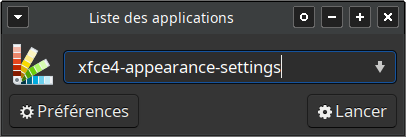

Cette page présente les logciels que j'utilise, avec ou sans personnalisation, pour m'aider à mieux supporter l'exposition aux écrans d'ordinateur malgré mon hypersensibilité à la lumière.

# Logiciels
## Système d'exploitation
J'ai quitté le monde Windows en 2009 pour [Linux](https://www.leparisien.fr/guide-shopping/pratique/quelle-difference-entre-linux-windows-et-mac-19-11-2019-8196654.php), et plus précisément [Xubuntu](https://xubuntu.fr/), dont je suis extrêmement satisfait. Avec quelques connaissances informatiques, Linux permet de personnaliser à peu près n'importe quel détail de l'expérience utilisateur, en particulier l'apparence. C'est particulièrement pratique dans ma situation.


### Si vous venez du monde Windows
Si vous avez des connaissances en informatique ou si vous pouvez vous faire aider par quelqu'un, il est possible d'essayer Linux sur un ordinateur Windows, sans risque de "casser" quoi que ce soit sur l'ordinateur. Pour en savoir plus, jetez un oeil à [ces instructions](https://doc.ubuntu-fr.org/live_usb). Si vous voulez essayer Xubuntu, vous devrez simplement:
1. Télécharger un fichier `.iso`, appelé "image", qui contient tout le nécessaire pour faire fonctionner l'ordinateur sous Linux
   * Téléchargez [le fichier le plus récent parmi ceux marqués "LTS"](https://xubuntu.fr/) (pour long-term support). Ce sont les versions auxquelles aucune mise à jour lourde ne sera imposée pendant 3 ans
   * Au moment d'écrire ces lignes, mon ordinateur tourne sous Xubuntu 23.04
3. Installer ce fichier `.iso` sur une clef USB en suivant [les instructions](https://doc.ubuntu-fr.org/live_usb) mentionnées plus haut.

Ne lisez les sections suivantes que si votre ordinateur fonctionne sous Linux:
* Choix du thème
* Barre de menu
* Gestionnaire de fenêtres
* Jeu d'icônes

La section Navigateur est en revanche susceptible de vous intéresser même si vous utilisez Windows ou Mac.

### Si vous utilisez déjà Linux
Ne lisez les sections suivantes que si votre environnement de bureau est [XFCE](https://www.xfce.org/?lang=fr):
* Choix du thème
* Barre de menu
* Gestionnaire de fenêtres

Les sections Jeu d'icônes et Navigateur sont en revanche susceptibles de vous intéresser même si vous utilisez un autre environnement de bureau.

### Jeu d'icônes
J'utilise depuis longtemps le jeu d'icônes Faenza. Il propose plusieurs jeux différents compatibles avec des thèmes sombres ("dark"), très sombres ("darker") et très très sombres ("darkest").
Pour l'installer, lancer un terminal et saisir:
```
sudo add-apt-repository ppa:tiheum/equinox

sudo apt-get update && sudo apt-get install faenza-icon-theme
```

### Choix du thème
Cette section suppose que vous utilisez Linux avec l'environnement de bureau [XFCE](https://www.xfce.org/?lang=fr). C'est le cas si vous utilisez Xubuntu (dont le nom signifie "[Ubuntu](https://www.ubuntu-fr.org/) avec XFCE").

Par défaut, XFCE propose plusieurs thèmes sombres, c'est-à-dire où les textes sont affichés en blanc sur fond sombre.

Pour choisir un thème, ouvrez le menu `Apparence`. Pour cela, il existe deux options:
1. Allez dans: `Démarrer > Paramètres > Apparence > Style`.
2. Appuyez simultanément sur les touches `ALT` et `F2` et tapez `xfce4-appearance-settings` (en fait, saisir `appear` devrait suffire, l'autocomplétion fera le reste).



Je vous conseille de choisir le style `Adwaita-sombre`. D'après mon expérience, il offre un contraste légèrement supérieur à celui du style `Greybird-dark`.


Dans la même fenêtre "Apparence", ouvrez ensuite l'onglet "Icônes" et sélectionnez un jeu d'icônes à votre goût. Je vous conseille Faenza Darkest, qui ressort bien avec le style `Adwaita-sombre`.


### Gestionnaire de fenêtres
Style: Greybird-dark-accessibility

Title: replace Noto Sans Bold with Noto Sans Regular

### Barre de menu

## Navigateur
J'ai utilisé 

# Retour
[Cliquez ici pour retourner à l’index.](index)
