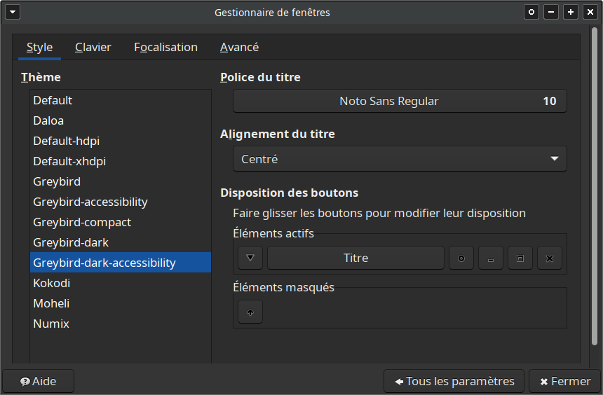

Cette page présente les logciels que j'utilise, avec ou sans personnalisation, pour m'aider à mieux supporter l'exposition aux écrans d'ordinateur malgré mon hypersensibilité à la lumière.

# Logiciels
## Système d'exploitation
J'ai quitté le monde Windows en 2009 pour [Linux](https://www.leparisien.fr/guide-shopping/pratique/quelle-difference-entre-linux-windows-et-mac-19-11-2019-8196654.php), et plus précisément [Xubuntu](https://xubuntu.fr/), dont je suis extrêmement satisfait. Avec quelques connaissances informatiques, Linux permet de personnaliser à peu près n'importe quel détail de l'expérience utilisateur, en particulier l'apparence. C'est particulièrement pratique dans ma situation.


### Si vous venez du monde Windows
Si vous avez des connaissances en informatique ou si vous pouvez vous faire aider par quelqu'un, il est possible d'essayer Linux sur un ordinateur Windows, sans risque de "casser" quoi que ce soit sur l'ordinateur. Pour en savoir plus, jetez un oeil à [ces instructions](https://doc.ubuntu-fr.org/live_usb). Si vous voulez essayer Xubuntu, vous devrez simplement:
1. Télécharger un fichier `.iso`, appelé "image", qui contient tout le nécessaire pour faire fonctionner l'ordinateur sous Linux
   * Téléchargez [le fichier le plus récent parmi ceux marqués "LTS"](https://xubuntu.fr/) (pour long-term support). Ce sont les versions auxquelles aucune mise à jour lourde ne sera imposée pendant 3 ans
   * Au moment d'écrire ces lignes, mon ordinateur tourne sous Xubuntu 23.04
3. Installer ce fichier `.iso` sur une clef USB en suivant [les instructions](https://doc.ubuntu-fr.org/live_usb) mentionnées plus haut.

Ne lisez les sections suivantes que si votre ordinateur fonctionne sous Linux:
* Choix du style
* Barre de menu
* Gestionnaire de fenêtres
* Jeu d'icônes

La section Navigateur est en revanche susceptible de vous intéresser même si vous utilisez Windows ou Mac.

### Si vous utilisez déjà Linux
Ne lisez les sections suivantes que si votre environnement de bureau est [XFCE](https://www.xfce.org/?lang=fr):
* Choix du style
* Barre de menu
* Gestionnaire de fenêtres

Les sections Jeu d'icônes et Navigateur sont en revanche susceptibles de vous intéresser même si vous utilisez un autre environnement de bureau.

### Jeu d'icônes
J'utilise depuis longtemps le jeu d'icônes Faenza. Il propose plusieurs jeux différents compatibles avec des styles sombres ("dark"), très sombres ("darker") et très très sombres ("darkest").
Pour l'installer, lancer un terminal et saisir:
```
sudo add-apt-repository ppa:tiheum/equinox

sudo apt-get update && sudo apt-get install faenza-icon-theme
```

### Choix du style
Cette section suppose que vous utilisez Linux avec l'environnement de bureau [XFCE](https://www.xfce.org/?lang=fr). C'est le cas si vous utilisez Xubuntu (dont le nom signifie "[Ubuntu](https://www.ubuntu-fr.org/) avec XFCE").

Le style définit l'apparence de ce qui est affiché à l'intérieur des fenêtres des applications, le fond, la police de caractère, etc. Il définit aussi l'apparence de certains éléments visuels qui ne sont pas des fenètres. C'est le cas de la barre de menu tout en haut ou tout en bas de l'écran, par exemple.

Par défaut, XFCE propose plusieurs styles sombres, c'est-à-dire où les textes sont affichés en blanc sur fond sombre.

Pour choisir un style, ouvrez le menu `Apparence`. Pour cela, il existe deux options:
1. Allez dans: `Démarrer > Paramètres > Apparence > Style`.
2. Appuyez simultanément sur les touches `ALT` et `F2` et tapez `xfce4-appearance-settings` (en fait, saisir `appear` devrait suffire, l'autocomplétion fera le reste).


Je vous conseille de choisir le style `Adwaita-sombre`. D'après mon expérience, il offre un contraste légèrement supérieur à celui du style `Greybird-dark`.


Dans la même fenêtre "Apparence", ouvrez ensuite l'onglet "Icônes" et sélectionnez un jeu d'icônes à votre goût. Je vous conseille Faenza Darkest, qui ressort bien avec le style `Adwaita-sombre`.


### Gestionnaire de fenêtres
#### Style de la barre de titre
Nous allons maintenant choisir l'apparence de la barre en haut des fenêtres. Ceci se fait dans le menu `Gestionnaire de fenêtres`. Là encore, il existe deux options:
1. Allez dans: `Démarrer > Paramètres > Gestionnaire de fenêtres > Style`.
2. Appuyez simultanément sur les touches `ALT` et `F2` et tapez `xfwm4-settings`.


Essayez différents styles pour décider celui qui vous convient le mieux. Personnellement, j'ai choisi `Greybird-dark-accessibility`.



#### Police des titres
Profitez-en également pour choisir une taille et une police de titre à votre goût. Par exemple, j'ai remplacé `Noto Sans Bold` par `Noto Sans Regular`, qui est plus fine et produit donc moins de "surface lettrée blanche" éblouissante.

### Barre de menu (Tableau de bord)
Nous allons ici personnaliser l'apparence de la barre de menu située en haut ou en bas de votre écran. Cette barre contient le plus souvent le menu `Démarrer`, une horloge, une zone de notification, etc. Dans XFCE, cette barre de menu s'appelle "Tableau de bord".

Pour atteindre le menu permettant de personnaliser le tableau de bord, il existe deux options:
1. Allez dans: `Démarrer > Paramètres > Tableau de bord`.
2. Appuyez simultanément sur les touches `ALT` et `F2` et tapez `xfce4-panel --preferences`.


Dans l'onglet `Affichage`


1. Commencez par ajuster la taille du menu pour rendre son contenu plus visible et lisible. Je n'hésite pas à afficher une barre de 50px de haut et sur toute la largeur de l'écran.
2. Comme la logique qui masque le tableau de bord peut être irritante au début, je vous conseille aussi de mettre `Masquer automatiquement le tableau de bord: JAMAIS`
3. Par défaut, le tableau de bord est une barre horizontale. Si vous souhaitez changer l'orientation, faites-le dans le champ `Mode` en haut de l'onglet.
4. Pour déplacer le menu, décochez la case `Verrouiller le tableau de bord`. Des poignées apparaissent alors aux extrêmités du tableau de bord. Cliquez dessus pour le déplacer.
5. Si vous souhaitez déplacer le tableau de bord vers un autre écran, sélectionnez `Sortie: Automatique` en haut de l'onglet.
6. Une fois que sa place vous convient, pensez à vérouiller le tableau de bord en cochant la case `Verrouiller le tableau de bord`.

Dans l'onlet `Apparence`


1. Cochez la case `Mode sombre`
2. Choisissez un `Arrière-plan` d'un style `Couleur unie` et choisissez une couleur à votre goût. Pour aller avec les styles `Adwaita-sombre` et `Greybird-dark-accessibility`, j'ai choisi un gris sombre `#232323`.
3. Vous pouvez modifier les autres champs de l'onglet pour observer leur effet.

Une fois satisfait du résultat, fermez la fenètre de configuration du tableau de bord.

### Horloge
Nous allons donner à l'horloge du tanleau de bord l'apparence d'un grand écran LCD. Pour cela, faites un clic-droit sur l'horloge puis cliquez sur `Propriétés`. Je vous propose de vous inspirer des réglages suivants:


## Navigateur
J'ai utilisé 

# Retour
[Cliquez ici pour retourner à l’index.](index)
