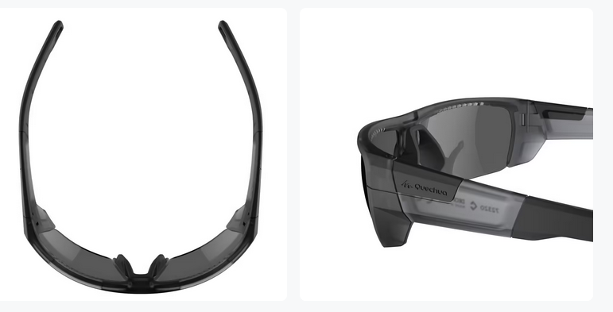

Cette page présente le processus de sélection de lunettes de soleil que j'ai suivi en raison de ma soudaine [hypersensibilité à la lumière](index).

# Lunettes de soleil
Étant hypersensible à la lumière, porter des lunettes de soleil appropriées a considérablement amélioré ma qualité de vie. D'après mes discussions avec des ergothérapeutes et des opticiens spécialisés, le choix des lunettes capables de soulager l'hypersensibilité repose sur les éléments suivants:
1. la teinte des verres, plus ou moins foncée
2. la polarisation des verres
3. la géométrie de la monture: courbure et épaisseur des branches

## Teinte des verres
### Éblouissement et UV
Il faut distinguer protection contre l'éblouissement et protection contre les ultra-violets. Par définition, **l'éblouissement est causé par la lumière visible**. S'en protéger passe par le port de verres teintés. Au contraire, **les ultra-violets sont invisibles**, puisqu'ils correspondent là aussi par définition au spectre lumineux au delà du violet, qui est la couleur la plus intense perceptible par l'oeil humain. S'en protéger passe par l'application d'un traitement sur les verres. Ce traitement peut être invisible.

En résumé, des verres très sombres, c'est-à-dire très efficaces contre l'éblouissement, ne protègeront pas nécessairement contre les UV. Inversement, des verres transparents traités contre les UV peuvent très bien filtrer les UV solaires à 100 % mais ne protégeront pas du tout contre l'éblouissement.

Cette section ne traite que de la protection contre l'éblouissement. Celle-ci est codifiée par [un texte de loi européen](https://eur-lex.europa.eu/legal-content/FR/TXT/HTML/?uri=CELEX:32016R0425). Un chiffre de 0 à 4 indiquant le degré de protection contre l'éblouissement est indiqué dans le descriptif de chaque paire de lunettes de soleil [[source](https://www.visilab.ch/fr/votre-vision/verres-solaires)]. Les catégories 3 et 4 sont les plus intéressantes en cas d'hypersensibilité à la lumière.

### Catégorie 0
**Ces verres filtrent entre 0% et 20% de la lumière**. Ce sont en général des lunettes à visée esthétique qui ne permettent pas de se protéger efficacement du rayonnement ultra-violet en cas d'exposition à une luminosité solaire forte.

### Catégorie 1
**Ces verres filtrent entre 20% et 57% de la lumière**. Ils sont recommandés pour des situations d'ensoleillement atténué, comme par exemple en hiver ou par temps très gris. Cet indice n'est pas conseillé pour une exposition massive à de forts rayonnements du soleil.

### Catégorie 2
**Ces verres filtrent entre 57% et 82% de la lumière**. Ils sont conseillés pour des situations d'ensoleillement moyen.

### Catégorie 3
**Ces verres filtrent entre 82% et 92% de la lumière**. Ils sont efficaces dans des situations de forte luminosité: à la mer, à la plage, ou pour les sports d'hiver.

### Catégorie 4
**Ces verres filtrent plus de 92% de la lumière**. Ils sont indiquées en cas de luminosité extrême comme par exemple pour l'alpinisme sur les glaciers ou en haute montagne car la luminosité est décuplée par la réverbération sur la glace et la neige.

Attention: certains pays interdisent de conduire en portant des lunettes de catégorie 4.

## Couleur des verres
Des verres teintés en gris atténueront la luminosité perçue sans altérer les couleurs.

Au contraire, des verres bleus, marrons ou de toute autre couleur, modifieront la perception des couleurs.

## Polarisation des verres
Des verres polarisants aident à améliorer le contraste. La page Wikipedia sur la [Polarisation_(optique)](https://fr.wikipedia.org/wiki/Polarisation_(optique)#Dans_la_vie_de_tous_les_jours) explique ce phénomène.

## Monture
Afin de limiter l'éblouissement par des sources lumineuses situées à la périphérie du champ visuel, il est recommandé de choisir des montures arquées avec des branches épaisses, voire même des panneaux latéraux pour limiter l'éblouissement par le coté.

## Concrètement
En l'état actuel de ma sensibilité à la lumière, je porte le plus souvent des verres polarisants de catégorie 4 en extérieur et des verres non polarisants de catégorie 3 en intérieur. Lorsque je peux totalement controler la luminosité de mon environnement, comme par exemple la pièce qui me sert de bureau en télétravail, je peux même mettre mes anciennes lunettes de vue non teintées et non polarisantes.

## Références
Toutes les références ci-dessous filtrent 100% des UV nocifs (données fabricant).

Vous verrez que j'ai pris toutes mes lunettes chez Décathlon. Cela s'explique par les raisons suivantes:
1. Il est possible d'essayer les produits et, s'ils ne conviennent pas, de les rapporter pour échange ou remboursement, pendant 30 jours et jusqu'à 1 an [sous conditions](https://www.decathlon.ch/fr/landing/365-jours-retour/_/R-a-a140016v).
2. Je porte depuis longtemps et avec satisfaction un de leurs modèles de lunettes de soleil pour cyclistes (voir plus bas).
3. Il existe un magasin près de choix moi :)

Dans la mesure où j'espère bien que ma vision continuera de s'améliorer, le point 1 ci-dessus me permettra d'échanger mes lunettes, si besoin, au fur et à mesure des progrès.

##### Catégorie 4 polarisante ou non: [Décathlon Quechua MH590](https://www.decathlon.ch/fr/p/lunettes-de-soleil-randonnee-mh590-adulte-polarisantes-categorie-4/_/R-p-181313?mc=8548667)
Ces lunettes arquées ont des verres gris et des branches très larges qui ne laissent passer aucune source de lumière latérale. Elles existent aussi en version non-polarisante.

#### Catégorie 3 non-polarisante: [Décathlon Van Rysel Roadr 500](https://www.decathlon.ch/fr/p/lunettes-de-velo-adulte-roadr-500-categorie-3-noires/_/R-p-181317?mc=8405401)
Je possèdais déjà ces lunettes avant ma perte de vision. De teinte bleue, les verres altèrent les couleurs. Bien que je les utilise désormais dans un tout autre contexte, elles sont suffisamment arquées pour filtrer la lumière venant de toutes les directions. Malheureusement, ces lunettes n'existent pas en version polarisante.

#### Catégorie 3 polarisante: [Décathlon Tribord 500](https://www.decathlon.ch/fr/p/lunettes-de-soleil-polarisees-flottantes-voile-adulte-500-taille-m-petrole/_/R-p-325360)
Moins courbées et avec des branches moins larges, ces lunettes teintées en bleu sont un peu moins protectrices que les modèles précédents. Elles restent cependant un choix tout à fait convenable pour mon usage.

# Retour
[Cliquez ici pour retourner à l'index](index).
