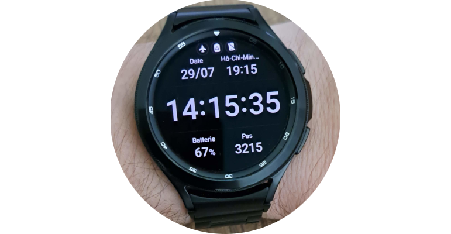

Cette page présente la montre que j'ai choisie suite à ma soudaine hypersensibilité à la lumière.

# Montre
Entre éblouissement dès que je suis en extérieur et difficultés à distinguer les faibles contrastes, j'ai dû mettre de côté la montre qui m'accompagnait depuis de nombreuses années. Je l´ai remplacée par une montre connectée disposant d'un écran [AMOLED](https://fr.wikipedia.org/wiki/Diode_%C3%A9lectroluminescente_organique#Avantages) dont le principal atout est d'afficher à la fois des noirs profonds et des couleurs intenses. Ces éléments permettent un contraste important et une lecture confortable même en plein soleil.

Mon choix s'est porté sur la [Samsung Galaxy Watch 4 Classic](https://www.samsung.com/fr/watches/galaxy-watch/galaxy-watch4-classic-black-bluetooth-sm-r890nzkaxef/) qui est déjà un modèle ancien donc trouvable en promotion tout en étant toujours officiellement commercialisé et supporté par Samsung. En me contentant de l'utiliser pour afficher l'heure, mon agenda et le nombre de pas effectués dans la journée, la batterie dure deux jours ou plus. J'apprécie également la facilité avec laquelle il est possible de personnaliser l'écran. Il m'a fallu moins de 10 minutes pour modifier un des modèles de cadrans pré-installés, le passer en texte blanc sur fond noir et remplacer quelques informations peu utiles par d'autres qui le sont davantage (un second fuseau horaire, dans mon cas).

# Retour
[Cliquez ici pour retourner à l'index](index).
