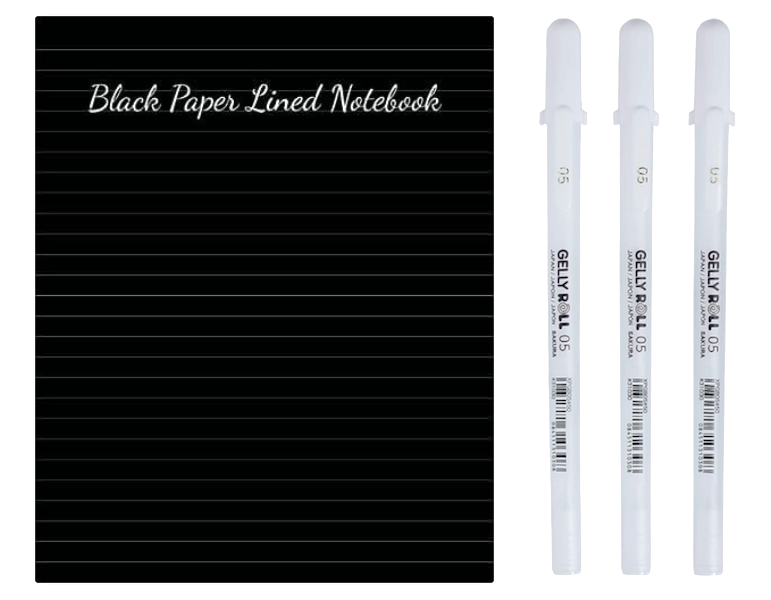
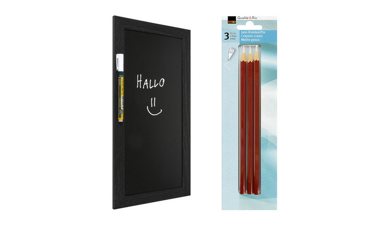

# Prise de notes
L'hypersensibilité à la lumière rend appréciable voire indispensable l'écriture blanche sur fond noir. Voici donc les références que j'utilise actuellement:

## Cahier et stylos
- Cahier de 200 pages noires [Black Paper Notebook](https://www.amazon.fr/dp/B0C1HWZ7N1) (je n'ai trouvé de tels cahiers que sur ce site de e-commerce)
- Stylos à encre blanche [Gelly Roll par Sakura](https://www.amazon.fr/dp/B07DN9KRCJ) (j'ai découvert ces stylos dans une papeterie qui les vend moins cher que les b
outiques en ligne)

## Ardoise et crayons de craie
Une alternative plus économique et plus écologique à la commande de cahiers est l'utilisation d'une [ardoise](https://www.jumbo.ch/fr/sejour-eclairage/accessoires-d-interieur/panneaux-d-affichage-tapis/ardoise-murale-woody/p/5996775) avec des [crayons de craie](https://www.jumbo.ch/fr/sejour-eclairage/papeterie/fournituresappareils-de-bureau/divers/3-craies-pour-jeux-de-carte/p/4210167) qui j'ai trouvés au rayon jeux et jouets de mon magasin. J'ai appris que ces crayons sont utilisés par les joueurs de cartes pour noter les scores.

## Liseuse électronique avec prise de notes
Il existe de plus en plus de liseuses permettant non seulement de lire mais aussi de prendre des notes en mode sombre. J'ai hésité entre les trois références suivantes:
- Kindle Scribe ([lien](https://www.amazon.fr/dp/B09BSQ365J))
- Kobo Elipsa 2E ([lien](https://www.kobo.com/media-hub/kobo-elipsa-2e))
- Onyx Boox Tab Ultra C ([lien](https://onyxboox.com/boox_tabultrac))

J'ai finalement choisi la Kindle Scribe pour des raisons toutes personnelles: je connaissais déjà les produits Kindle alors que je n'ai pas pu essayer la Kobo Elipsa 2E ni la Tab Ultra C. Par ailleurs, ma liseuse précédente étant une Kindle Paperwhite, ma bibliothèque était déjà en grande partie compatible avec l'écosystème Kindle. De plus, j'étais toujours très satisfait de cette liseuse que j'avais pourtant utilisée intensivement depuis 2015, son seul défaut à mes (nouveaux) yeux étant de ne pas offrir de lecture en mode sombre. Enfin, la Scribe était en solde au moment où je faisais mon étude de marché; cela lui offrait ainsi un rapport qualité prix certes temporaire mais qui a fini de me convaincre.

Mes principaux reproches à l'encontre de la Kindle Scribe sont:
1. le faible choix de coques de protection, en particulier à des prix abordables,
2. l'impossibilité, que j'espère temporaire, de synchroniser ses notes avec Google Drive.

N'ayant pu tester la Kobo Elipsa 2E ni l'Onyx Boox Tab Ultra C, je ne suis malheureusement pas en mesure de me prononcer sur leurs avantages et inconvénients respectifs, au delà de ce que j'ai pu lire sur internet.

## Retour
[Cliquez ici pour retourner à l’index.](index)
